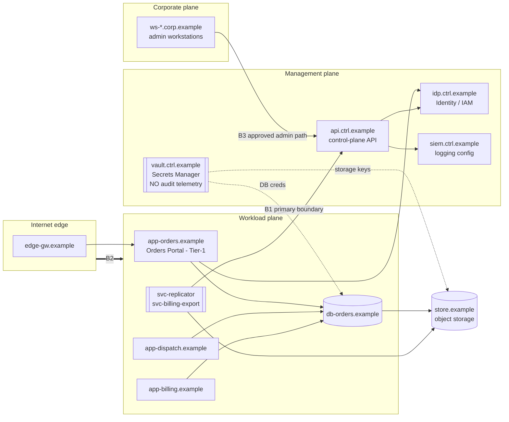

# Cloud Architecture — Kestrel Freight Cloud

> Fictional, vendor-neutral, synthetic. All hostnames use
> `.example`; all addresses use RFC 5737 / RFC 3849 documentation ranges.

This is the component-level view behind [`overview.md`](./overview.md). It names
every element the spec requires and maps each to the log family that observes it,
so participants can trace a detection idea to the telemetry that supports it.

## Components and their telemetry

| Component | Plane | Host (fictional) | Observed by family |
|---|---|---|---|
| Internet-facing entry | edge | `edge-gw.example` | `network`, `application` |
| Admin / staff workstations | corporate | `ws-*.corp.example` | `admin`, `identity` |
| Orders Portal (Tier-1 app) | workload | `app-orders.example` | `application`, `identity` |
| Dispatch Engine | workload | `app-dispatch.example` | `application` |
| Billing & Settlement | workload | `app-billing.example` | `application`, `network` |
| Orders DB | workload | `db-orders.example` | `network` |
| Cloud control-plane API | management | `api.ctrl.example` | `cloud` |
| Identity Service / IAM | management | `idp.ctrl.example` | `identity`, `cloud` |
| Secrets Manager | management | `vault.ctrl.example` | **none — no audit telemetry** |
| Object / data storage | (shared) | `store.example` | `network`, `cloud` |
| Logging / SIEM pipeline | management | `siem.ctrl.example` | `cloud` (config changes) |

## App / database relationship

Orders Portal is the only Tier-1 business app. It reads and writes the **Orders
DB** over the workload plane; it never talks to the database directly from the
edge. Database credentials come from the **Secrets Manager**, not from config
files. Manifests and billing exports flow from the DB to **object storage**.

## Identity, admin, and automation paths

- **Identity:** all human and service logins authenticate through the Identity
  Service (`idp.ctrl.example`), emitting the `identity` family.
- **Admin path (approved):** administrators (`j.okafor`) reach the management
  plane only from corporate workstations through the approved admin path. This is
  the sanctioned corporate -> management crossing.
- **Automation / service-account path:** service accounts (`svc-replicator`,
  `svc-billing-export`) run inside the workload plane and call the control-plane
  API or storage. `svc-replicator` is high-volume and periodic — legitimately
  noisy (candidate #8).

## Trust boundaries (enumerated)

| # | Boundary | Rule | Notable crossing |
|---|---|---|---|
| B1 | workload -> management | Only the approved admin path and named service accounts may cross | Unexpected SSH/admin crossing = candidate #1 |
| B2 | edge -> workload | Only via Orders Portal / edge gateway | Direct edge -> DB would be anomalous |
| B3 | corporate -> management | Only admins via approved path | Non-admin crossing is suspicious |

B1 is the **primary trust boundary** for this workshop.

## Component diagram

## Reading the architecture as a detection engineer

- Cross-plane crossings (B1) are the signal for lateral-movement reasoning.
- The control-plane API is where logging can be disabled and IAM can be changed.
- Object storage + the periodic network flow summary are where bulk transfer shows.
- The Secrets Manager is the visible **hole** in coverage — real risk, no telemetry.
