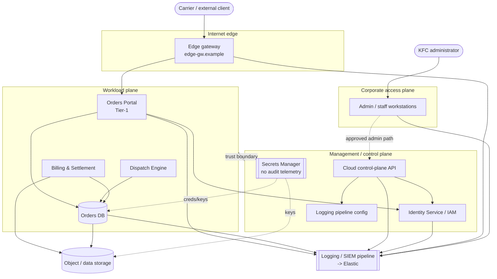

# Architecture Overview — Kestrel Freight Cloud

> Fictional, vendor-neutral, synthetic. No AWS/Azure/GCP
> terms are required to understand it. Documentation-safe identifiers only.

KFC runs on a vendor-neutral fictional cloud. The environment is split into three
**trust planes** — corporate, workload, and management — plus an internet-facing
entry point. The split is the source of the most important detection choices:
crossings between planes should be rare and are worth watching.

## The three planes at a glance

| Plane | Contains | Who belongs here |
|---|---|---|
| Internet edge | Edge gateway (`edge-gw.example`) | Carriers, external clients |
| Corporate access | Staff/admin workstations | KFC employees |
| Workload | Orders Portal, Dispatch, Billing, Orders DB | Application traffic + service accounts |
| Management/control | Cloud control-plane API, IAM, Secrets Manager, logging config | Admins + automation only |

The **key trust boundary** is between the workload plane and the management plane.
Application traffic never needs the management plane; administrators reach it only
through an approved admin path. An SSH or admin session that crosses from
corporate or workload into management outside that path is a signal (candidate #1).

## Telemetry flow

Every plane ships events to a logging/SIEM pipeline that normalizes them into the
log families in [`logs/field-dictionary.md`](../logs/field-dictionary.md) and
lands them in Elastic. The pipeline also **enriches** some events (for example, it
stamps a rolling failed-login count onto auth events, and outbound-byte totals onto
periodic network flow summaries). If the pipeline is disabled or tampered with,
detection capability drops — which is why interference with it is high severity
(candidate #3). The Secrets Manager, notably, emits **no audit telemetry** into the
pipeline today (candidate #7 gap).

## Diagram

For component-level detail, service accounts, admin/automation paths, and the
enumerated trust boundary, see [`cloud-architecture.md`](./cloud-architecture.md).
